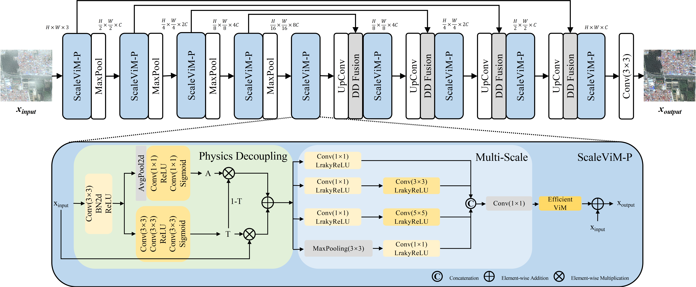

# ScaleViM-PDD: Multi-Scale EfficientViM with Physical Decoupling and Dual-Domain Fusion for Remote Sensing Image Dehazing

This is the official PyTorch implementation of the paper:

> **ScaleViM-PDD: Multi-Scale EfficientViM with Physical Decoupling and Dual-Domain Fusion for Remote Sensing Image Dehazing**  
> Hao Zhou, Yalun Wang, Wanting Peng, Xin Guan, and Tao Tao  
> *Remote Sensing*, 2025  
> [MDPI Link](https://www.mdpi.com/2072-4292/17/15/2664)

---

### 🚀 Getting Started 

We train and test the code on **PyTorch 1.13.0 + CUDA 11.7**. The detailed configuration is mentioned in the paper.

### Create a new conda environment
<pre lang="markdown">conda create -n ScaleViM-PDD python=3.8 
conda activate ScaleViM-PDD  </pre>

## 📦 Available Resources 

While the code is being finalized, you can access the following components:

- 🔹 **model weights**  
  [📥 Download](ScaleVIM-PDD
Link: https://pan.baidu.com/s/18dS3bJoZM4-shghvlJrKuQ Extraction code: 1230)

- 🔹 **RSID dataset (used for training and evaluation)**  
  [📥 Download](https://drive.google.com/drive/folders/1abSw9GWyyOJINWCRNHBUoJBBw3FCttaS?usp=drive_link)

## 🙏 Acknowledgment 

Our project is based on **[EfficientViM](https://github.com/mlvlab/EfficientViM)**, and we are very grateful for this excellent work. Their efficient state-space model provides a new benchmark for many image domains.

## 📖 Citation
If you find our work useful for your research, please consider citing us:
<pre lang="markdown"> 
@article{zhou2025scalevim,
  title     = {ScaleViM-PDD: Multi-Scale EfficientViM with Physical Decoupling and Dual-Domain Fusion for Remote Sensing Image Dehazing},
  author    = {Zhou, Hao and Wang, Yalun and Peng, Wanting and Guan, Xin and Tao, Tao},
  journal   = {Remote Sensing},
  volume    = {17},
  number    = {15},
  pages     = {2664},
  year      = {2025},
  publisher = {MDPI},
  doi       = {10.3390/rs17152664},
  url       = {https://doi.org/10.3390/rs17152664}
}
  </pre>

---

Stay tuned for the full release, including training/inference code and detailed documentation. If you have any questions, please feel free to contact us at aaron@ahut.edu.cn
